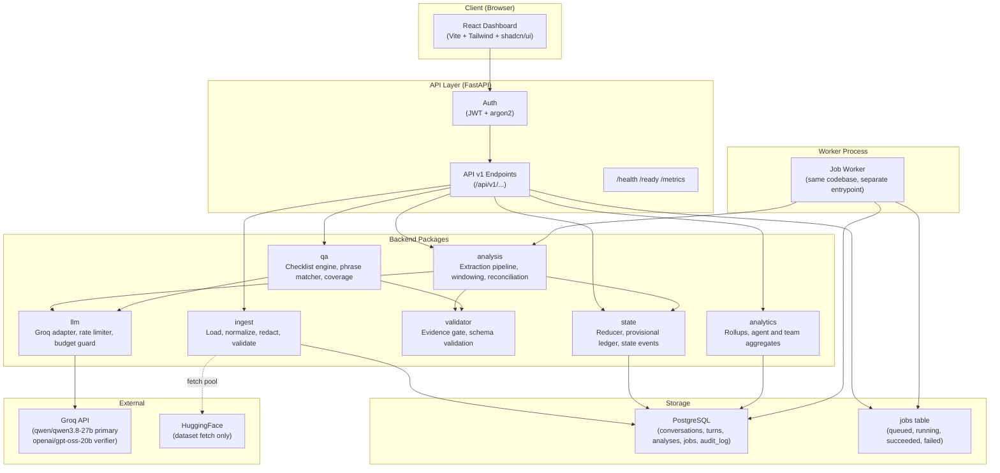
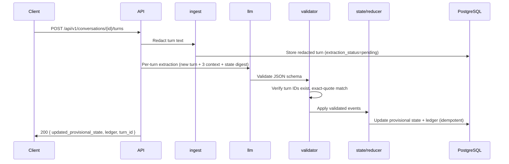
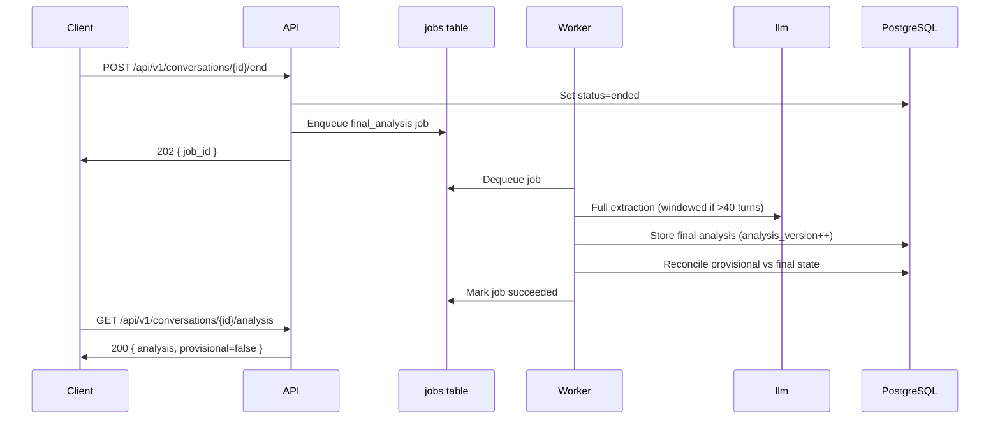
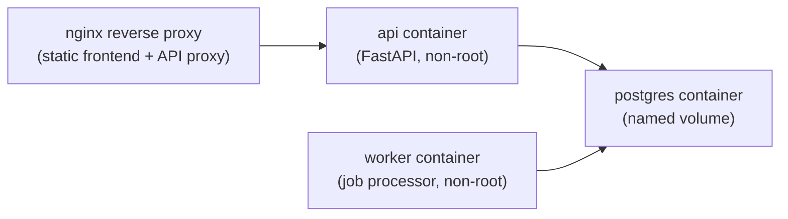

# EchoInsight Architecture

## Problem

Telecom contact centers review only 2% of calls manually. Quality teams have limited visibility into why customers call or how agents perform. The goal is to automatically analyze every conversation and surface actionable insights.

## High-Level Architecture

## Package Responsibilities

| Package | Responsibility |
|---------|---------------|
| `ingest` | Load and normalize CSV/JSON input; validate columns; map `client` to `customer`; normalize whitespace; detect and flag duplicates; assign synthetic agent and team; validate turn ordering |
| `llm` | Provider-agnostic adapter interface; Groq implementation; token-bucket rate limiter; exponential backoff with jitter; daily budget guard; `Retry-After` handling; test double |
| `analysis` | Incremental (per-turn) and batch (full conversation) extraction pipelines; long-call windowing; summary, reasons, sentiment trajectory, resolution, churn signals; final reconciliation |
| `state` | Deterministic idempotent reducer; state event log; provisional and final commitment ledger; false-resolution detector; open-commitment queue |
| `qa` | QA checklist engine; keyword/regex phrase matcher; per-item scoring (pass/fail/not_applicable/needs_review); coverage calculation; selective verification hooks |
| `validator` | Evidence gate (turn ID existence + exact-quote check); schema validation; output consistency checks; error categorization; retry routing |
| `analytics` | Conversation rollups; agent and team aggregate queries; KPI computation; materialized or incremental rollup updates |
| `api` | FastAPI router; Pydantic request/response schemas; JWT auth middleware; central authorization dependency; pagination; error handlers |

## Data Flow: Incremental (Live) Mode

## Data Flow: Batch (Final) Mode

## Security Boundary

- All endpoints except `/health`, `/ready`, and `/api/v1/auth/login` require a valid JWT.
- Authorization scope (which conversations an agent or supervisor can see) is derived server-side from the authenticated user's team and agent membership in the database.
- Client-supplied `team_id` or `agent_id` may only narrow results within the caller's own scope, never widen it.
- Transcripts sent to Groq are redacted. Original text is never stored or transmitted.

## Deployment Topology (Production)

## Key Design Choices

- **Modular monolith**: Easier to test and deploy than microservices for MVP; clear path to extraction if needed.
- **Idempotent reducer**: All state changes are keyed by (conversation_id, turn_id, event_type, target). Replaying or retrying never creates duplicate ledger entries.
- **Evidence gate**: Every LLM output claim must be backed by a verifiable quote. This is the primary reliability guarantee.
- **Coverage metric**: QA scores are always reported with coverage so a high score from a small applicable subset is never misleading.
- **Selective verification**: Verification calls are targeted (high-risk claims only) to preserve quota.
- **Provisional badges**: Incremental state is clearly labeled `provisional=true` in storage, API, and UI until finalized.
